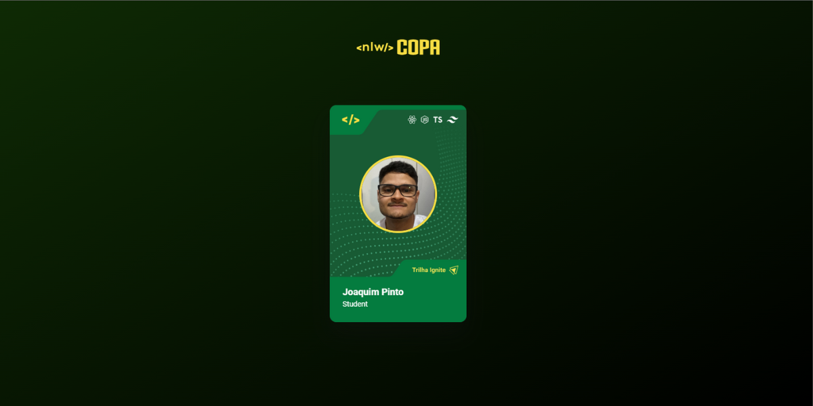

# nlw-copa-card
 ⚽ Projeto desenvolvido através do evento da NLW Copa da Rocketseat.

 📁 O projeto Card NLW foi desenvolvido com o objetivo de criar seu próprio card voltado para o tema da Copa.
 
 ✅ Tecnologias utilizadas: HTML5, CSS3, JavaScript, Git e Github.

